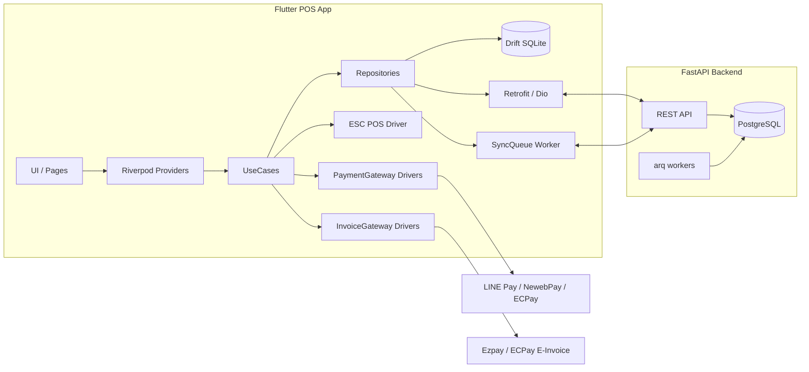
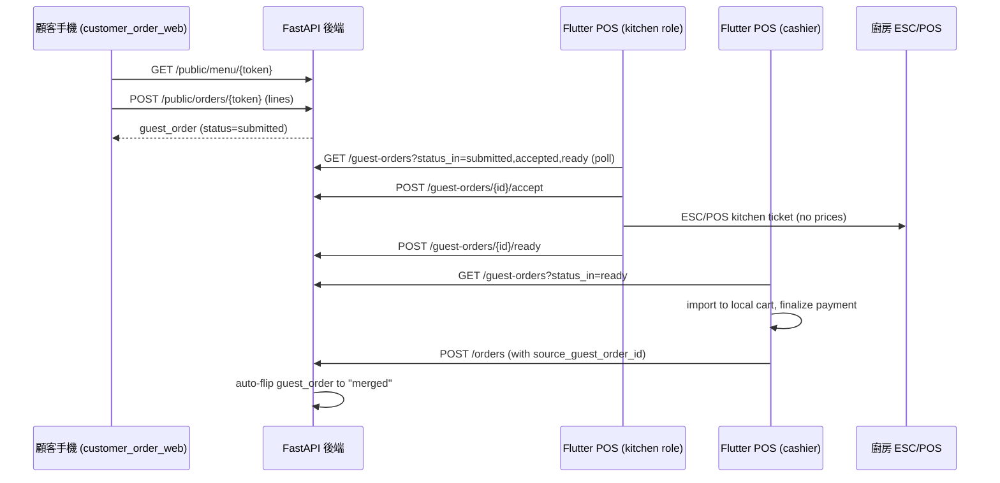

# Architecture

## Overview



## Layered Dependency Direction

`presentation` → `domain` ← `data`

- `domain` (in [packages/pos_domain](../packages/pos_domain)): pure Dart entities, repository **interfaces**, gateway **interfaces**, the promotion engine. Has zero Flutter dependency.
- `data` (in `apps/pos_app/lib/features/<feat>/data`): repository **implementations**, drift DAOs, Retrofit clients, gateway adapters.
- `presentation` (in `apps/pos_app/lib/features/<feat>/presentation`): Riverpod state, pages, widgets.

## State Management

We use Riverpod 2.x with `riverpod_generator`. Use-cases and repositories are exposed via `@riverpod` providers.

## Multi-store / Multi-terminal

- Every write carries `(store_id, terminal_id, client_uuid)`.
- Server validates `terminal_id` against an issued API key.
- `pos.order.id` is generated by POS as **uuid v7** and is the canonical id.

## Sync Strategy

See [sync_protocol.md](sync_protocol.md).

## Code Generation

The Flutter app uses `build_runner`:

```bash
melos run build_runner
```

…to regen Riverpod providers, freezed unions, drift schemas and Retrofit clients.

## Testing

- `pos_domain/test/`: pure-Dart promotion + cart math tests.
- `apps/pos_app/test/`: widget + use-case tests.
- `apps/pos_app/integration_test/`: end-to-end (Desktop preferred for headless CI).
- `apps/api/tests/`: pytest with httpx + factory-boy. End-to-end coverage of
  the QR table-side ordering flow lives in
  [test_qr_ordering.py](../apps/api/tests/test_qr_ordering.py).

## QR table-side ordering



- Customer Vue SPA: [apps/customer_order_web](../apps/customer_order_web) — renders the
  menu, builds a cart, submits a `guest_order`. **No payment gateway** —
  the customer always pays at the counter.
- Admin tables management + QR print: [apps/admin](../apps/admin) under
  `/tables` and `/tables/print` routes.
- Backend: `dining_tables`, `guest_orders`, `guest_order_lines` tables and
  the `/public`, `/admin/tables`, `/guest-orders` routes in
  [apps/api/app/api/v1](../apps/api/app/api/v1).
- Flutter POS: `kitchen` role lands on the KDS board
  ([kds_board_page.dart](../apps/pos_app/lib/features/kds/pages/kds_board_page.dart));
  the cashier pulls "ready" guest orders into the cart via the
  `/table-orders` page.
