# 點餐趣 
---

## 一、點餐趣是什麼？

**點餐趣**是一套 **雲端 POS + 管理後台** 的企業級點餐／零售方案：

| 您得到什麼 | 白話說明 |
|------------|----------|
| **收銀機 App** | 平板／電腦櫃台結帳、掃碼、會員、促銷自動計算 |
| **管理後台** | 手機／電腦隨時改菜單、設活動、看今日營收 |
| **桌邊 QR 點餐**（可選） | 客人掃桌碼自己點，廚房／櫃台接單，減少人力 |
| **雲端帳務中心** | 訂單、會員、庫存、報表集中，多店也能管 |

**一句話**：前台賣得順、後台管得住、數據看得清。

---

## 二、系統長什麼樣子？（三塊拼圖）

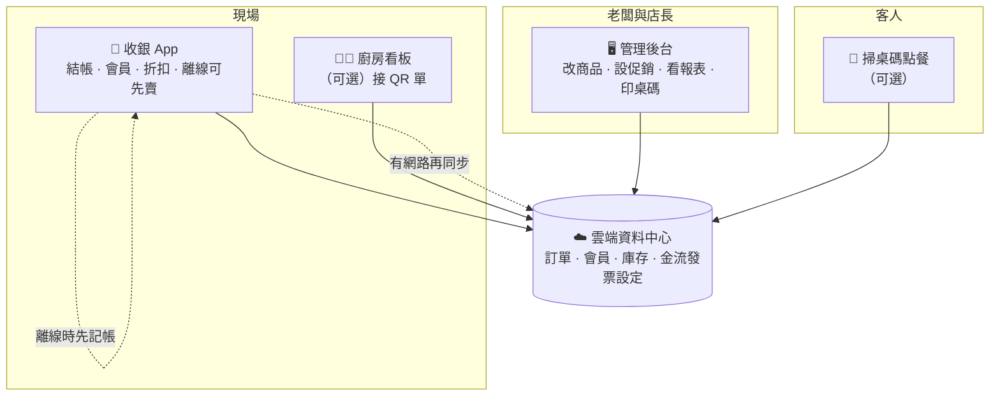

| 模組 | 誰用 | 價值 |
|------|------|------------------|
| 管理後台 | 您、店長、總部 | 不用跑現場也能改價、上活動、看今天賣多少 |
| 收銀 App | 店員 | 結帳快、促銷不會算錯、斷網仍可先收銀 |
| QR 點餐 | 客人 + 廚房／櫃台 | 尖峰少喊單、少漏單，人力花在招待與出餐 |

---

## 三、最關心的 6 件事（對照表）

| # | 問題 | 點餐趣怎麼回答 |
|---|------------|----------------|
| 1 | 今天賣多少？ | 後台 **總覽**：今日訂單數、今日營收、商品／會員／活動一目了然 |
| 2 | 活動會不會亂扣？ | 後台設規則（滿額折、第 N 件折扣、買二送一…），收銀 **自動帶入**，可設優先順序與是否疊加 |
| 3 | 多店、多收銀機好管嗎？ | 一個 **租戶（品牌）** 底下多 **店面**、多 **終端**；每台機器有專屬金鑰，誰在哪台賣可追溯 |
| 4 | 客人願意再來嗎？ | **會員綁定**（手機／QR）、等級與促銷可綁會員，做回購與分眾 |
| 5 | 尖峰人力不夠？ | **QR 桌邊點餐**：印桌碼 → 客人自助點 → 廚房接單 → 熟客櫃台結帳 |
| 6 | 資料會不會外流？ | 管理員才能 **註冊收銀機**；員工只用帳密登入；金流／發票金鑰 **加密存雲端**，後台不回傳明文 |

---

## 四、實際畫面導覽

### 4.1 管理後台 — 您的「營運指揮中心」

#### 登入：一個網址管整家店

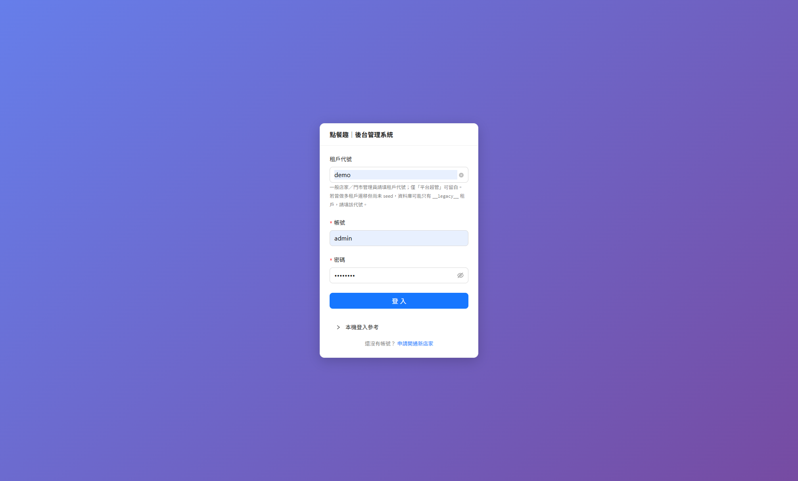

- **一般店家**：填 **租戶代號**（開店時給您的那組代碼）+ 管理員帳密。  
- **平台營運方**（若您是同業 SaaS 營運者）：租戶代號可留白，用平台帳號審核新店家。  
- 還沒帳號？畫面下方可 **申請開通**（Email 驗證 → 平台審核 → 自動開店）。

#### 總覽：開機先看這一頁

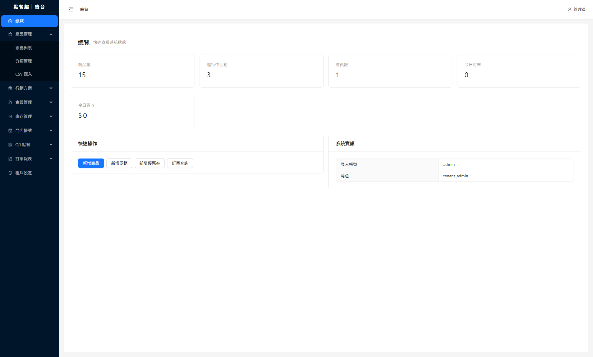

| 區塊 | 老闆怎麼用 |
|------|------------|
| **商品數 / 活動數 / 會員數** | 資產有沒有備齊（菜單、促銷、會員池） |
| **今日訂單 / 今日營收** | 當日業績心跳；出問題可先對這兩個數字 |
| **快速操作** | 臨時加品項、加促銷、查單，不用在選單裡找半天 |

左側選單涵蓋日常營運：**產品 · 行銷 · 會員 · 庫存 · 門店與桌位 · QR 點餐監看 · 訂單報表 · 租戶設定**（金流、發票、訂閱用量）。

#### 桌邊點餐：印 QR，客人自己點

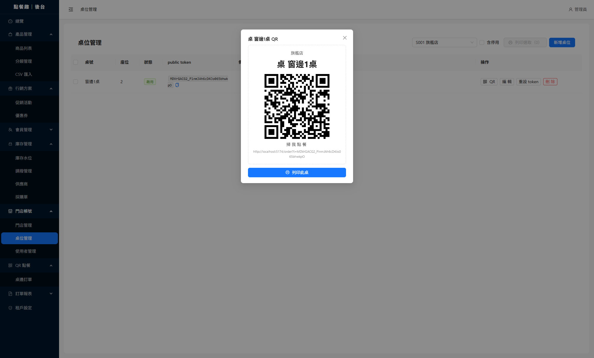

1. **門店帳號 → 桌位管理**：新增桌號、座位數。  
2. 按 **QR** → 產生該桌專屬碼 → **列印貼桌**。  
3. 客人掃碼進點餐頁，廚房／櫃台依流程接單（詳見下方流程圖）。

#### 促銷：規則在後台設，現場不會算錯

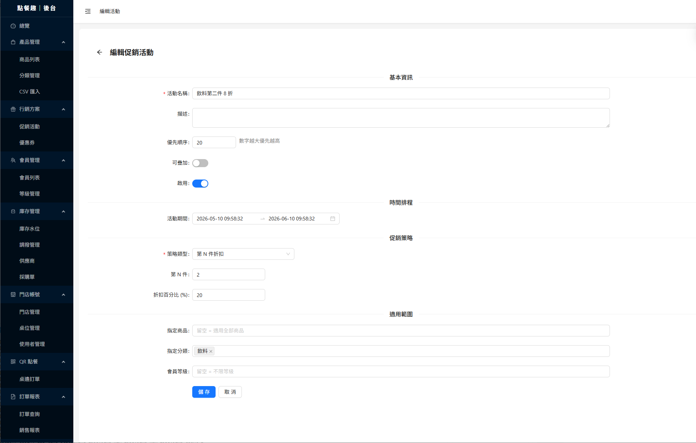

範例：**飲料第二件 8 折** — 指定分類「飲料」、第 2 件 20% off、活動期間、優先順序、是否可與其他活動疊加。  
**心法**：規則寫清楚一次，全店收銀機同步，不用靠店員背促銷表。

---

### 4.2 收銀 App — 第一線的「賣錢機器」

#### 第一次：管理員幫機器「辦身分證」

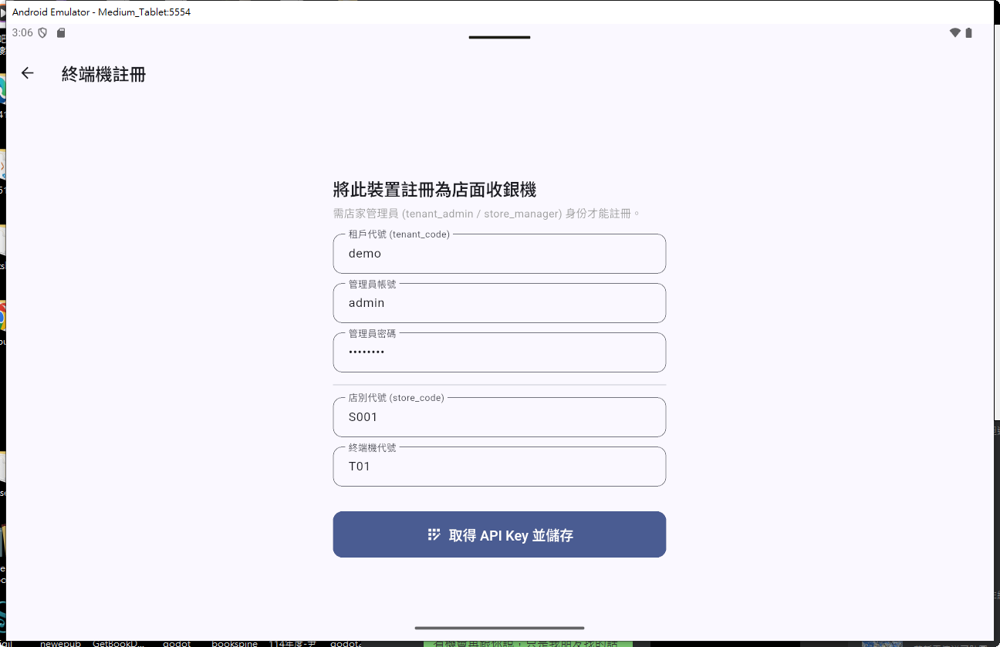

- 僅 **店長／管理員** 可註冊，避免陌生人綁定您的店。  
- 填租戶、店面、終端編號 → 取得 **API Key** 並存於該平板。  
- **一次設定**，之後店員只需帳密登入。

#### 日常登入：店員 3 個欄位就夠

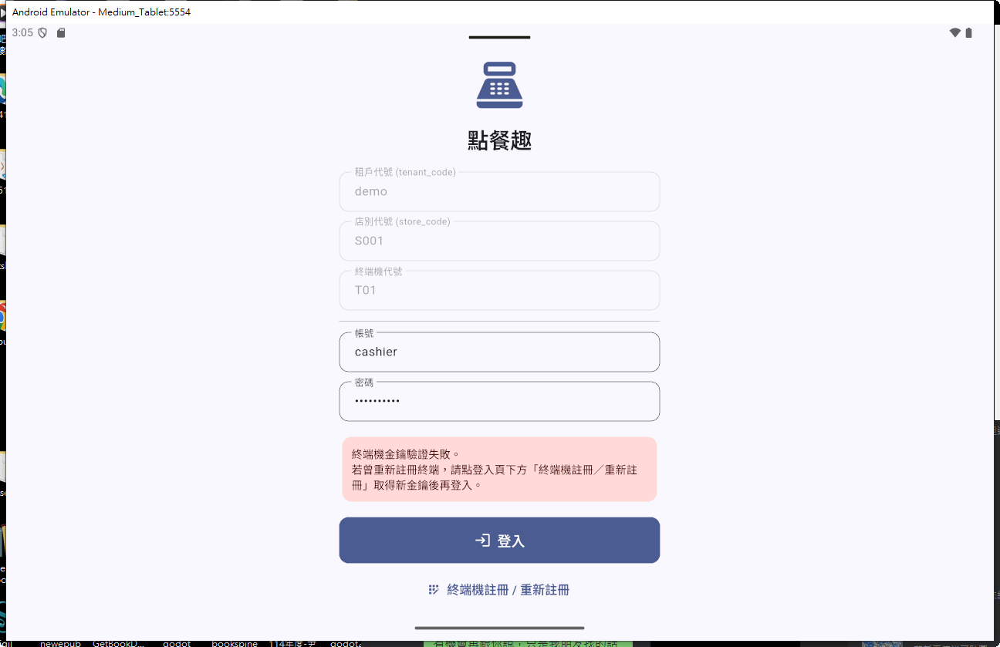

租戶／店面／終端通常已固定；店員輸入 **帳號、密碼** 即可。  
若顯示「終端金鑰驗證失敗」，代表管理員曾重設過機器 — 走畫面下方 **重新註冊** 即可，無需叫工程師。

#### 收銀主畫面：快、清楚、會員與折扣一次搞定

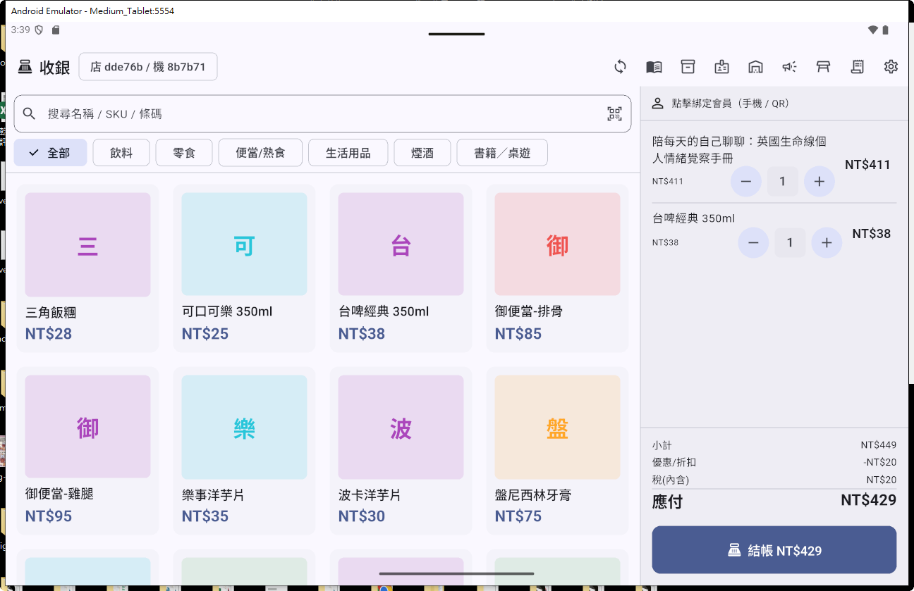

| 功能 | 現場效益 |
|------|----------|
| 搜尋／掃 **條碼** | 便利商店、書店、餐飲都適用 |
| **分類** 切換 | 尖峰時少滑頁，找品項更快 |
| **綁定會員** | 累點、會員價、分眾促銷 |
| 小計／折扣／稅／**應付** | 客人看得懂，店員不會口算錯 |
| 一鍵 **結帳** | 進入付款與（若開通）電子發票流程 |

#### 促銷在櫃台也看得見

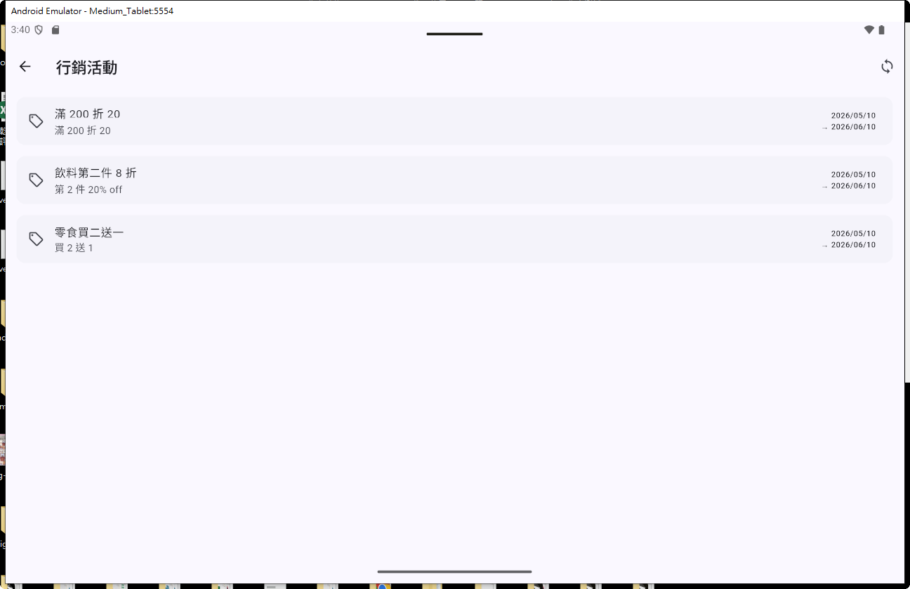

店員可確認 **目前有哪些活動、到什麼時候**；實際折扣仍由系統計算，減少「店員說有、系統說沒有」的爭議。

#### 品類與商品圖：像電商一樣好點

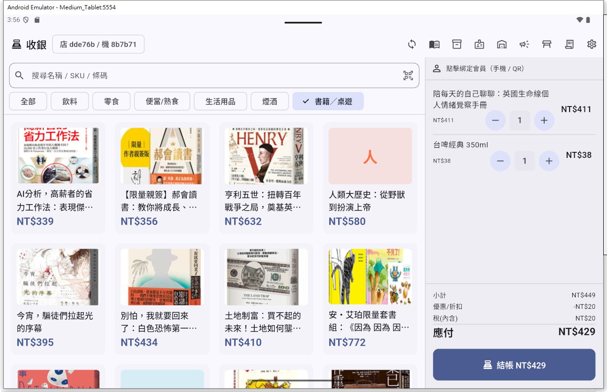

書籍／桌遊等 **有圖商品** 以大圖呈現；切換分類即可。  
（專案另含 **書籍掃碼示範**，可接外部書目 API，適合書店業態延伸。）

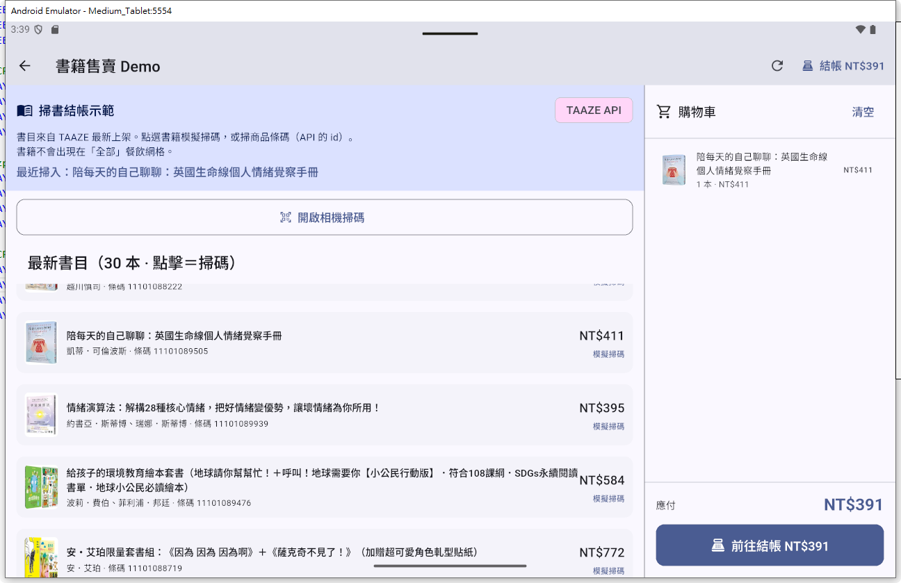

---

## 五、一天怎麼跑？（流程）

### 5.1 開新店（您只要知道節點）

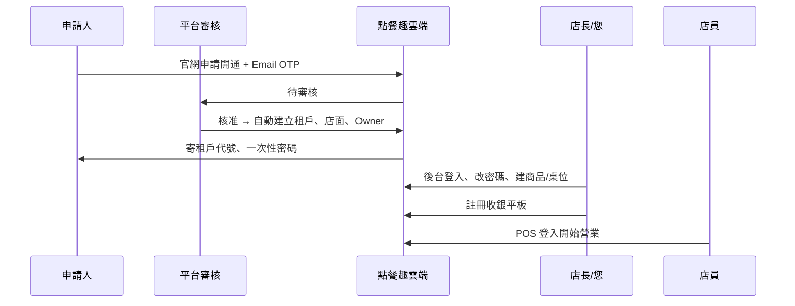

### 5.2 有 QR 點餐時，客人到離開

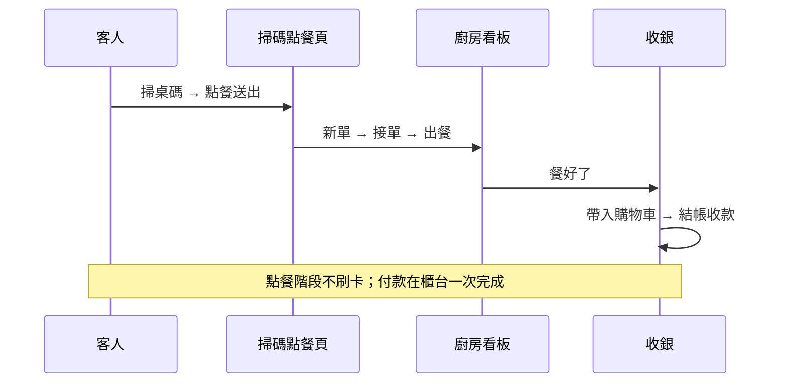

### 5.3 您每天 5 分鐘例行

| 時間 | 動作 | 在哪裡 |
|------|------|--------|
| 開店前 | 看昨日／今日營收、確認活動是否到期 | 後台 **總覽**、**行銷方案** |
| 營業中 | 缺貨、臨時漲價、加品項 | **產品管理**、**庫存** |
| 尖峰 | 監看 QR 單是否堆單 | **QR 點餐** |
| 打烊 | 對帳、查異常單 | **訂單報表** |
| 每月 | 看會員成長、活動 ROI | **會員**、**報表** |

---

## 六、角色分工（誰需要什麼權限）

| 角色 | 典型人選 | 能做什麼 | 為何要分權 |
|------|----------|----------|----------------|
| **品牌擁有者** | 您 | 租戶設定、金流發票、訂閱、匯出資料 | 金流密鑰不給店長亂改 |
| **店長／管理員** | 店長 | 商品、促銷、桌位、註冊收銀機、報表 | 日常營運自主、您放心出差 |
| **收銀** | 店員 | 結帳、查活動、綁會員 | 碰不到成本和後台設定 |
| **廚房** | 內場 | QR／內場單看板 | 前場不被喊單打斷 |
| **平台超管** | 系統商（若適用） | 審核新店家、租戶停啟用 | 與您店內角色分離 |

---

## 七、投資報酬：效益

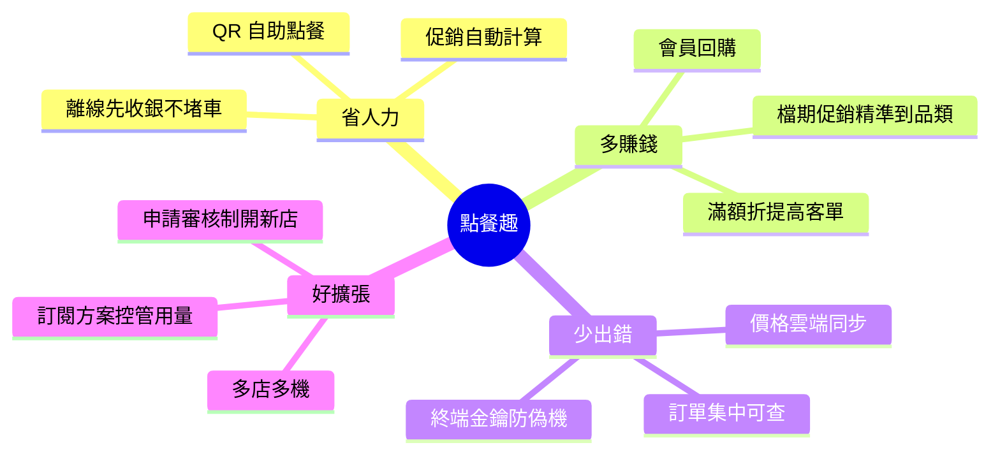

| 痛點 | 沒有系統時 | 有點餐趣後 |
|------|------------|------------|
| 促銷算錯、客訴 | 靠店員背規則 | 後台設好，收銀自動算 |
| 尖峰喊單亂 | 前台、廚房、客人三方混亂 | QR + 廚房看板分流 |
| 斷網不能賣 | 干等或手寫 | POS **先本地記帳**，恢復網路再同步 |
| 多店數字慢 | Excel、電話對帳 | 後台即時 **今日營收／訂單** |
| 機器流失風險 | 誰都能裝 App | **管理員註冊** + 終端金鑰 |

---

## 八、金流、發票、訂閱（老闆只需知道原則）

| 主題 | 您需要知道的 |
|------|----------------|
| **收款** | 可接 ECPay、藍新、LINE Pay 等（依合約開通）；金鑰在 **租戶設定** 填一次，加密存放 |
| **電子發票** | 同樣在租戶設定綁定；未設定時開發環境可能用平台測試參數 |
| **訂閱方案** | 限制店面數、終端數、每月訂單量等；超限時系統會提示升級，避免帳單爆量 |

細部操作見 repo 根目錄 **[操作手冊.md](../操作手冊.md)**；環境安裝見 **[安裝手冊.md](../安裝手冊.md)**。

---

## 九、附錄：畫面檔案對照

| 檔案 | 內容 |
|------|------|
| `admin_01.png` | 後台登入 |
| `admin_02.png` | 總覽儀表板 |
| `admin_03.png` | 桌位與 QR |
| `admin_04.png` | 促銷活動設定 |
| `pos_01.png` | 收銀登入 |
| `pos_02.png` | 終端註冊 |
| `pos_03.png` | 書籍掃碼示範（延伸場景） |
| `pos_04.png` | 收銀主畫面 |
| `pos_05.png` | 收銀端活動列表 |
| `pos_06.png` | 分類商品（書籍／桌遊） |

---

## 十、下一步

| 您是… | 建議 |
|--------|------|
| **決策者** | 用本文件第四、七節對內說明；技術驗收再翻 [架構說明](../docs/architecture.md) |
| **店長** | 跟著 [操作手冊.md](../操作手冊.md) 實際登入後台與 POS 走一輪 |
| **IT／廠商** | [安裝手冊.md](../安裝手冊.md) + `apps/api/.env.example` |

---

*文件版本：依 odoo_pos 專案現況整理 · 截圖位於本目錄 `pos_doc/`*
